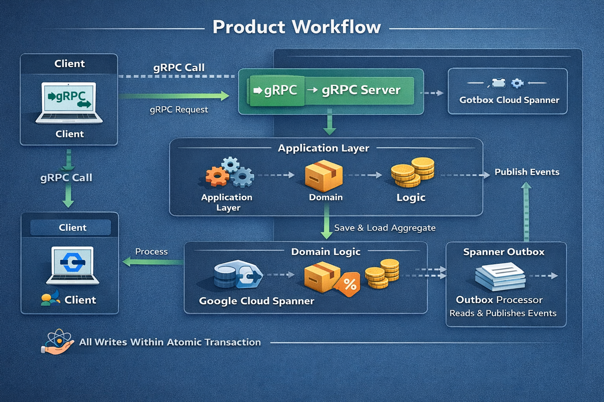

# Product Catalog Service

A simplified **Product Catalog Service** built with Go, following domain-driven design, clean architecture, CQRS, and the Golden Mutation Pattern. It uses **Google Cloud Spanner** (emulator for local dev), **gRPC** with Protocol Buffers, and a transactional outbox for events.

## Overview — How it works

The diagram below shows how client requests flow through the service: from gRPC calls into the application and domain layers, then to Spanner for persistence, with events published reliably via the outbox pattern.



---

### 1. Go 1.21+

- Download: https://go.dev/dl/
- Install and add `GOROOT` and `GOPATH/bin` to `PATH`.

### 2. Spanner emulator (choose one)

- **Option A – Docker**  
  [Docker Desktop](https://www.docker.com/products/docker-desktop/). Then: `docker-compose up -d`.

- **Option B – No Docker (gcloud)**  
  [Google Cloud SDK](https://cloud.google.com/sdk/docs/install). Install the emulator component, then start it with `gcloud emulators spanner start`. See [Running without Docker](#running-without-docker) below.

### 3. (Optional) Protocol Buffers compiler and Go plugins

Only needed if you want to regenerate Go code from `.proto` (the repo includes hand-written stubs so the project builds without `protoc`).

- **protoc**: https://github.com/protocolbuffers/protobuf/releases (add to `PATH`)
- **Go plugins** (with Go in `PATH`):
  ```powershell
  go install google.golang.org/protobuf/cmd/protoc-gen-go@latest
  go install google.golang.org/grpc/cmd/protoc-gen-go-grpc@latest
  ```
- Ensure `GOPATH\bin` (or `$env:USERPROFILE\go\bin`) is on `PATH` so `protoc` can find the plugins.

### 4. (Optional) Make on Windows

- Use **Chocolatey**: `choco install make`
- Or run the equivalent PowerShell commands below instead of `make`.

---

## Running without Docker

You can use the **Google Cloud SDK** Spanner emulator instead of Docker.

### 1. Install Google Cloud SDK

- Windows: https://cloud.google.com/sdk/docs/install  
- Or: `winget install Google.CloudSDK`

### 2. Install the Spanner emulator component

```powershell
gcloud components install cloud-spanner-emulator
```

If the component isn’t available, update gcloud first:

```powershell
gcloud components update
```

### 3. Start the emulator (in a separate terminal, keep it running)

```powershell
gcloud emulators spanner start
```

Default ports: **9010** (gRPC), **9020** (REST). Leave this terminal open.

### 4. Point your app to the emulator

In another terminal:

```powershell
cd product-catalog-service
$env:SPANNER_EMULATOR_HOST = "localhost:9010"
```

### 5. Create instance and database (one-time, with emulator running)

```powershell
gcloud config set project test-project
gcloud spanner instances create test-instance --config=emulator-config --description="Test" --nodes=1 --project=test-project
gcloud spanner databases create product-catalog --instance=test-instance --project=test-project --ddl-file=migrations/001_initial_schema.sql
```

Use `--project=test-project` so the emulator (which ignores real GCP) gets the commands.

### 6. Run the server or tests

```powershell
$env:SPANNER_EMULATOR_HOST = "localhost:9010"
$env:SPANNER_PROJECT = "test-project"
$env:SPANNER_INSTANCE = "test-instance"
$env:SPANNER_DATABASE = "product-catalog"
go run ./cmd/server
```

Or run E2E tests:

```powershell
$env:SPANNER_EMULATOR_HOST = "localhost:9010"
go test -v -tags=e2e ./tests/e2e/...
```

No Docker required.

---

## Quick start

### 1. Start Spanner emulator

```powershell
cd product-catalog-service
docker-compose up -d
```

Set the emulator host (PowerShell):

```powershell
$env:SPANNER_EMULATOR_HOST = "localhost:9010"
```

### 2. Create instance and database (one-time)

With **Google Cloud SDK** (`gcloud`) installed:

```powershell
# Create instance
gcloud spanner instances create test-instance --config=emulator-config --description="Test" --nodes=1 --project=test-project

# Create database and run DDL
gcloud spanner databases create product-catalog --instance=test-instance --project=test-project --ddl-file=migrations/001_initial_schema.sql
```

If you don’t have `gcloud`, you can use the Spanner emulator’s REST/gRPC APIs or a script to create instance and database; the DDL is in `migrations/001_initial_schema.sql`.

### 3. Run migrations

The schema is in `migrations/001_initial_schema.sql`. Apply it when creating the database (e.g. via `gcloud` as above or your preferred tool against the emulator).

### 4. Run tests

```powershell
go mod tidy
go test ./...
```

E2E tests (require emulator running and DB created):

```powershell
$env:SPANNER_EMULATOR_HOST = "localhost:9010"
go test -v -tags=e2e ./tests/e2e/...
```

### 5. Run the gRPC server

```powershell
$env:SPANNER_EMULATOR_HOST = "localhost:9010"
$env:SPANNER_PROJECT = "test-project"
$env:SPANNER_INSTANCE = "test-instance"
$env:SPANNER_DATABASE = "product-catalog"
go run ./cmd/server
```

Server listens on `:50051` by default. Override with `GRPC_ADDR`.

---

## Project structure

The folders below map to the layers shown in the [overview diagram](#overview--how-it-works) above.

- **`cmd/server`** – Entry point; wires Spanner client and starts the gRPC server.
- **`internal/app/product`** – Application layer:
  - **`domain`** – Aggregates (Product), value objects (Money, Discount), domain events, errors; no external deps.
  - **`usecases`** – Create/Update/Activate/Deactivate/ApplyDiscount/RemoveDiscount/Archive; follow the Golden Mutation Pattern (load → domain → plan → apply).
  - **`queries`** – GetProduct, ListProducts (read model).
  - **`contracts`** – Repository and read-model interfaces.
  - **`repo`** – Spanner implementation (mutations + load + read model).
- **`internal/models`** – DB models (`m_product`, `m_outbox`).
- **`internal/transport/grpc/product`** – gRPC handler, mappers, error mapping.
- **`internal/services`** – DI (options) and adapters from transport to usecases/queries.
- **`internal/pkg`** – Committer (plan/apply mutations) and clock.
- **`proto/product/v1`** – Proto definitions and hand-written Go stubs (replace with `protoc`-generated code if you use `protoc`).
- **`migrations`** – Spanner DDL.
- **`tests/e2e`** – E2E tests against the emulator.

---

## Design decisions

- **Domain purity**: Domain package has no `context`, no Spanner/sql, no proto; uses `*big.Rat` for money.
- **Golden Mutation Pattern**: Repositories return mutations; usecases build a plan and call `committer.Apply(ctx, plan)` in one transaction.
- **Transactional outbox**: Domain events are appended to an outbox table in the same transaction; no background processor in this repo.
- **CQRS**: Commands go through aggregates and commit plan; queries use a read model and DTOs.
- **Commit plan**: A local `pkg/committer` wraps Spanner and applies a slice of mutations in a single read-write transaction. You can swap this for `github.com/Vektor-AI/commitplan` (or similar) if your stack uses it.

---

## API (gRPC)

- **Commands**: CreateProduct, UpdateProduct, ActivateProduct, DeactivateProduct, ApplyDiscount, RemoveDiscount, ArchiveProduct.
- **Queries**: GetProduct (by ID, with effective price), ListProducts (paginated, filter by category/status).

Proto: `proto/product/v1/product_service.proto`.

---

## What is not implemented

- Authn/authz
- Background outbox processor / real Pub/Sub publishing
- Metrics/observability beyond basic logging
- REST or API gateway

---

## Troubleshooting (Windows)

- **`go: command not found`**  
  Add Go’s `bin` to `PATH` (e.g. `C:\Go\bin` and `%USERPROFILE%\go\bin`).

- **Spanner client errors**  
  Ensure `SPANNER_EMULATOR_HOST=localhost:9010` and the emulator is running (either `docker-compose up -d` or `gcloud emulators spanner start`). Instance and database must exist and DDL applied.

- **E2E tests skipped**  
  Set `SPANNER_EMULATOR_HOST` and create the database with the schema before running tests with `-tags=e2e`.
